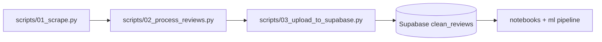

# Data Pipeline - App Review Insights

This repository collects, cleans, and uploads App Store reviews for a fixed set of apps/countries, then supports optional multilingual sentiment/topic enrichment. It is designed so contributors and operators can run the full workflow locally or on a daily GitHub Actions schedule.

## Who This Is For
- Contributors maintaining ETL scripts and SQL schema.
- Analysts who need clean review data in Supabase.
- Operators who want to run or "host" the pipeline locally.

## What This Pipeline Does
1. Scrapes App Store reviews by app and country from `config/apps.json`.
2. Cleans and normalizes text (emoji/url cleanup, dedupe, language filtering).
3. Runs incremental filtering against Supabase by:
`(source, app_name, country, source_review_id)`.
4. Uploads cleaned rows into Supabase table `clean_reviews`.
5. Optionally runs ML sentiment/topic analysis for downstream reporting.

## Architecture / Data Flow


Runtime artifacts are written to:
- `data/raw/` (scraped files + run summary)
- `data/processed/` (cleaned CSV outputs)
- `data/metadata/` (incremental and cleaning summaries)
- `data/logs/` (reserved for logs)

## Repository Structure
```text
.
|- config/
|  `- apps.json
|- scripts/
|  |- 01_scrape.py
|  |- 02_process_reviews.py
|  |- 03_upload_to_supabase.py
|  `- utils_supabase.py
|- sql/
|  |- 001_create_tables.sql
|  `- 002_views_and_indexes.sql
|- ml/
|  |- README.md
|  `- pipeline/sentiment_topics.py
|- notebooks/
|- tests/
`- .github/workflows/
   |- pipeline.yml
   `- test_pipeline_connection_supabase.yml
```

## Prerequisites
- Python `3.11`
- Git
- A Supabase project (required for upload step, recommended for incremental dedupe in processing)
- Optional ML extras from `ml_requirements.txt`

## Quickstart (Copy/Paste)

### 1. Clone
```bash
git clone https://github.com/<your-org-or-user>/data_pipeline.git
cd data_pipeline
```

### 2. Create Virtual Environment
PowerShell:
```powershell
python -m venv .venv
. .\.venv\Scripts\Activate.ps1
```

bash/zsh:
```bash
python -m venv .venv
source .venv/bin/activate
```

### 3. Install Dependencies
```bash
pip install -r requirements.txt
```

### 4. Configure Environment Variables
Create `.env` in repo root:
```env
SUPABASE_URL=https://YOUR_PROJECT_ID.supabase.co
SUPABASE_SERVICE_ROLE_KEY=YOUR_SERVICE_ROLE_KEY
```

Optional: also load them into your current shell session.

PowerShell:
```powershell
$env:SUPABASE_URL="https://YOUR_PROJECT_ID.supabase.co"
$env:SUPABASE_SERVICE_ROLE_KEY="YOUR_SERVICE_ROLE_KEY"
```

bash/zsh:
```bash
export SUPABASE_URL="https://YOUR_PROJECT_ID.supabase.co"
export SUPABASE_SERVICE_ROLE_KEY="YOUR_SERVICE_ROLE_KEY"
```

Notes:
- `.env` is loaded by `scripts/utils_supabase.py`.
- You can still run scrape/process without valid Supabase credentials; `02_process_reviews.py` will disable incremental filtering if Supabase lookup fails.
- Upload (`03_upload_to_supabase.py`) requires valid Supabase credentials.

## Supabase Setup (Cloud First)
1. Create a Supabase project.
2. Open SQL Editor in Supabase.
3. Run SQL files in this order:
   1. `sql/001_create_tables.sql`
   2. `sql/002_views_and_indexes.sql`
4. Verify:
   - Table `clean_reviews` exists.
   - Unique constraint exists on `(source, app_name, country, source_review_id)`.
   - View `v_reviews_daily_stats` exists.

## Configure Scraping Scope
Edit `config/apps.json`:
- `apps`: array of app objects with:
  - `name` (internal app label)
  - `id` (App Store app ID)
- `countries`: two-letter country codes (for App Store review feed locale).
- `source`: source label stored in dataset (default `app_store`).
- `scrape_delay_seconds`: delay between app-country calls.

Example:
```json
{
  "apps": [
    { "name": "tinder", "id": 547702041 },
    { "name": "yubo", "id": 1038653883 }
  ],
  "countries": ["us", "fr"],
  "source": "app_store",
  "scrape_delay_seconds": 1
}
```

## Run Locally (Step by Step)

### Step 1: Scrape Raw Reviews
```bash
python scripts/01_scrape.py
```
Expected output:
- CSV snapshots in `data/raw/` named like:
  - `<app>_<country>_<YYYY-MM-DD>.csv`
- Run summary JSON in `data/raw/`:
  - `run_summary_<YYYY-MM-DD_HH-MM-SS>.json`

### Step 2: Process and Clean Reviews
```bash
python scripts/02_process_reviews.py
```
Expected output:
- Processed CSV files in `data/processed/`:
  - `<app>_<country>_clean_<YYYY-MM-DD_HH-MM-SS>.csv`
- Per-file metadata in `data/metadata/`:
  - `<app>_<country>_metadata_<timestamp>.json`
- Run summary metadata:
  - `run_clean_summary_<timestamp>.json`
  - `run_incremental_overview_<timestamp>.json`

### Step 3: Upload to Supabase
```bash
python scripts/03_upload_to_supabase.py
```
Expected behavior:
- Upserts cleaned rows into `clean_reviews` in batches.
- Skips files marked `no_new_reviews`.
- Logs warning if metadata references missing processed files.

## Incremental Processing Behavior
`02_process_reviews.py` calls Supabase before cleaning each app-country cohort:
- Fetches existing `source_review_id` values for `(source, app, country)`.
- Filters out already-ingested reviews before cleaning.

Metadata status values:
- `new_dataset`: no existing rows were filtered for that file.
- `partial_update`: some rows already existed and were skipped.
- `no_new_reviews`: nothing new to process/upload.

`03_upload_to_supabase.py` reads the latest `run_clean_summary_*.json` and:
- Uploads listed processed files.
- Skips entries marked `no_new_reviews`.
- Falls back to scanning `data/processed/*_clean_*.csv` if metadata is unavailable.

## Automation (GitHub Actions)

### Main Daily Pipeline
File: `.github/workflows/pipeline.yml`

- Triggers:
  - Scheduled: `0 6 * * *` (daily at 06:00 UTC)
  - Manual: `workflow_dispatch`
- Steps:
  1. Install Python 3.11 and dependencies
  2. Run `01_scrape.py`
  3. Run `02_process_reviews.py`
  4. Run `03_upload_to_supabase.py`
  5. Upload artifacts:
     - `data/**`
     - `data/metadata/**`
- Required secrets:
  - `SUPABASE_URL`
  - `SUPABASE_SERVICE_ROLE_KEY`

### Manual Supabase Connectivity Check
File: `.github/workflows/test_pipeline_connection_supabase.yml`

- Trigger: `workflow_dispatch`
- Purpose: quick read test against `clean_reviews` using repo secrets.

## Optional ML Workflow (Sentiment + Topics)
The ETL pipeline and ML pipeline are separate. ETL can run without ML dependencies.

### Install ML Dependencies
```bash
pip install -r ml_requirements.txt
```

### Use Notebook
- Open `notebooks/04_sentiment_topics_analysis.ipynb`.
- The notebook expects an input dataset at `data/processed_reviews.csv`.
- It produces:
  - `reviews_sentiment_topics.csv`
  - `notebooklm_reviews.csv`
  - `topic_summary.csv`

### Reusable Python Module
- Core functions are in `ml/pipeline/sentiment_topics.py`.
- Includes graceful fallbacks when model loading fails (for example, offline environments).

## Testing
Run tests:
```bash
pytest -q
```

Current focus:
- `tests/test_sentiment_topics.py` covers helper logic in `ml/pipeline/sentiment_topics.py`.
- Tests call `pytest.importorskip("spacy")`, so missing spaCy can skip ML-related tests.

## Troubleshooting

### Missing Supabase env vars
Symptoms:
- Upload script raises missing credentials error.

Fix:
- Ensure `.env` exists with `SUPABASE_URL` and `SUPABASE_SERVICE_ROLE_KEY`.
- Confirm you run commands from repo root.

### No files in `data/raw/`
Symptoms:
- Processor reports no raw files.

Fix:
- Run `python scripts/01_scrape.py` first.
- Check `config/apps.json` app IDs/countries are valid.

### `source_review_id` missing in raw input
Symptoms:
- Processor warns incremental filtering skipped for that file.

Fix:
- Keep scraper outputs unchanged before processing.
- Ensure custom raw files preserve `source_review_id`.

### Most reviews dropped during language filtering
Symptoms:
- Large drop after language detection stage.

Fix:
- Confirm country-to-language mapping in script matches your target countries.
- Validate review text quality and language mix in raw data.

### Upload skips files
Symptoms:
- `[SKIP] ... marked as no new reviews`

Fix:
- This is expected on reruns with no new review IDs.
- Inspect latest `data/metadata/run_clean_summary_*.json`.

## Security and Operations
- Never commit `.env`.
- Never commit `data/` artifacts (already ignored in `.gitignore`).
- Treat `SUPABASE_SERVICE_ROLE_KEY` as sensitive production credential.
- Store run artifacts in secure storage if sharing outside local machine.

## Roadmap / Extension Hooks
- Add `raw_reviews` and `run_logs` tables for full lineage.
- Add production sentiment writeback table(s) and views.
- Add alerting (for example Slack/webhook) on workflow failures.
- Add dashboard-oriented aggregates for trend monitoring.

## Current Operational Interface
This README documents the existing pipeline interfaces without changing code:
- `python scripts/01_scrape.py`
- `python scripts/02_process_reviews.py`
- `python scripts/03_upload_to_supabase.py`
- `sql/001_create_tables.sql`
- `sql/002_views_and_indexes.sql`
- `ml/pipeline/sentiment_topics.py`
